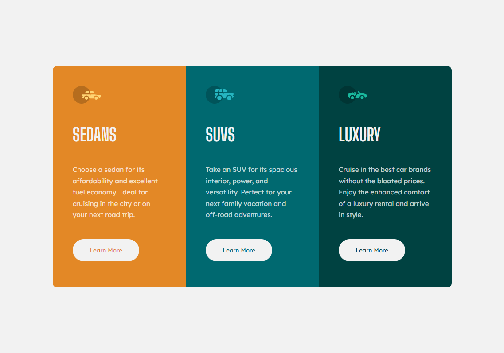

# 3-column preview card component

This is my solution to the [3-column preview card component challenge on Frontend Mentor](https://www.frontendmentor.io/challenges/3column-preview-card-component-pH92eAR2-)

## Table of contents

- [Overview](#overview)
  - [The challenge](#the-challenge)
  - [Screenshot](#screenshot)
  - [Links](#links)
- [My process](#my-process)
  - [Built with](#built-with)
  - [What I learned](#what-i-learned)
  - [Continued development](#continued-development)
  - [Useful resources](#useful-resources)
- [Author](#author)
- [Acknowledgments](#acknowledgments)

## Overview

### The challenge

- Build a page looking as close as possible to the [original design](./design/desktop-design.jpg)
- The page must have a responsive layout to suit different device screen sizes
- The buttons must have hover effect

### Screenshot



### Links

You can see a working version at [https://mateus3009.github.io/3-column-preview-card-component/](https://mateus3009.github.io/3-column-preview-card-component/)

## My process

### Built with

- HTML
- CSS

### What I learned

I used this challenge to remember some CSS features such as **css custom properties** and I finished learning something new:

- `@property` is a "*at rule*" that you can use to define a custom property with a initial value, define if it will be inherited or not and you can also define the type of value:
  ```css
  @property --default-rotation {
    syntax: '<angle>';
    inherits: true;
    initial-value: 45deg;
  }
  ```

### Continued development

I'm going to improve my CSS skills because today I usually spend a lot of time until I see the "LEGO" blocks that I have to style to get the result I want

### Useful resources

- [A Complete Guide to Custom Properties](https://css-tricks.com/a-complete-guide-to-custom-properties/)
- [A Complete Guide to Flexbox](https://css-tricks.com/snippets/css/a-guide-to-flexbox/)
- [HTML Semantic Elements](https://www.w3schools.com/html/html5_semantic_elements.asp)

## Author

 - Frontend Mentor - [@mateus3009](https://www.frontendmentor.io/profile/mateus3009)
 - LinkedIn - [Mateus Sales albino](https://www.linkedin.com/in/mateusalbino/)

## Acknowledgments

Thank you for checking out my project!
